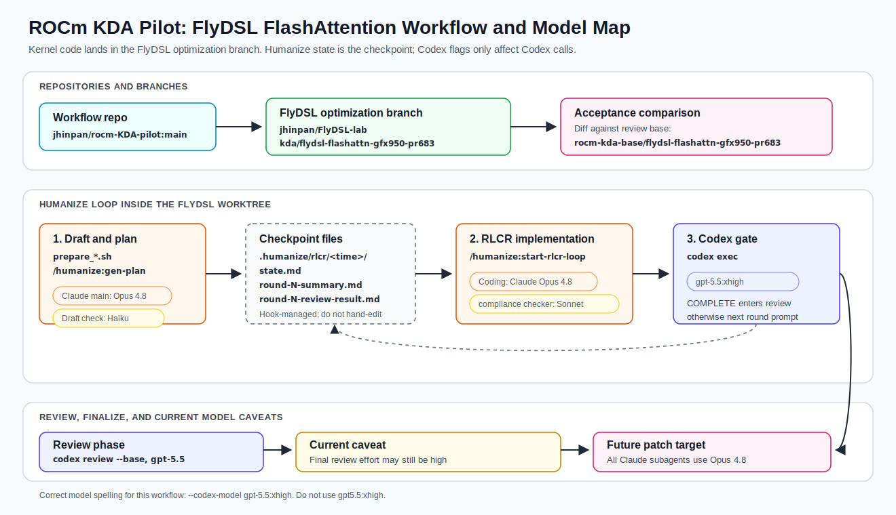

# ROCm KDA Pilot

ROCm KDA Pilot is a small workflow repo for running a BBuf/KDA-Pilot-style
Humanize loop on AMD ROCm kernel optimization tasks.

The first supported example is **optimizing
[`ROCm/FlyDSL`](https://github.com/ROCm/FlyDSL) FlashAttention forward on
gfx950 / MI350X-MI355X**, starting from
[`ROCm/FlyDSL#683`](https://github.com/ROCm/FlyDSL/pull/683) and using
[`ROCm/FlyDSL#670`](https://github.com/ROCm/FlyDSL/pull/670) as historical
context.

This repo assumes only this much is already installed on your Docker image or
node:

- Native Claude Code: `claude`
- Native OpenAI Codex CLI: `codex`
- A working ROCm/FlyDSL build environment for the target GPU

Everything else in the workflow is installed or wired up from here.

## What This Repo Provides

- A Humanize task draft template for FlyDSL FlashAttention on gfx950.
- A project skill, `rocm-kda-pilot`, that tells Claude how to run this workflow.
- Submodules for:
  - [`jhinpan/ROCmKernelWiki`](https://github.com/jhinpan/ROCmKernelWiki)
  - [`jhinpan/flydsl-rocprof-cli`](https://github.com/jhinpan/flydsl-rocprof-cli)
  - [`jhinpan/rocm-report-skill`](https://github.com/jhinpan/rocm-report-skill)
- A bootstrap script that links the skills into Claude Code and installs
  `flyprof`.
- A prepare script that copies the FlashAttention gfx950 draft into a FlyDSL
  worktree and prints the exact Humanize slash commands to run.

Humanize itself is not vendored here. Install it from the upstream
`PolyArch/humanize` Claude Code marketplace.

## Model Architecture Map

The workflow has two repositories and two model families in play:

- `jhinpan/rocm-KDA-pilot` is the workflow repo. It holds templates, scripts,
  skills, and docs.
- `jhinpan/FlyDSL-lab` is the FlyDSL fork where kernel experiments actually
  happen.
- Claude Code runs the implementation loop and Humanize slash commands.
- Codex is called by Humanize for independent analysis and review.



For the current FlashAttention gfx950 flow, acceptance happens in
`jhinpan/FlyDSL-lab` on:

```text
kda/flydsl-flashattn-gfx950-pr683
```

Review it against:

```text
rocm-kda-base/flydsl-flashattn-gfx950-pr683
```

`rocm-KDA-pilot` is not where optimized kernel code lands.

Current model usage:

| Stage | Worker | Current model behavior |
|---|---|---|
| Claude Code main session | Implements code, runs shell commands, drives Humanize | Whatever Claude Code was launched with; for our runs this should be Opus 4.8 |
| `/humanize:gen-plan` main work | Claude Code plus Humanize | Main Claude session model |
| `gen-plan` draft relevance check | Humanize subagent | Haiku in upstream Humanize |
| RLCR plan compliance pre-check | Humanize subagent | Sonnet in upstream Humanize |
| RLCR plan quiz | Humanize subagent | Opus in upstream Humanize, but skipped when using `--skip-quiz` |
| RLCR coding tasks | Claude Code main session | Should be Opus 4.8 if Claude Code was launched that way |
| RLCR analyze / ask-Codex tasks | Codex CLI | Intended as `gpt-5.5:xhigh` when passed through the RLCR command/config |
| RLCR stop-hook review summary | Codex CLI | Intended as `gpt-5.5:xhigh` |
| RLCR final Codex review | Codex CLI | Uses `gpt-5.5`; current upstream Humanize may still keep review effort at `high` |

Important: `--codex-model gpt-5.5:xhigh` controls Codex-side calls. It does
not force Humanize's Claude subagents from Sonnet/Haiku to Opus 4.8. If we want
all Claude-side agents to use Opus 4.8, that should be a later Humanize plugin
or config patch, not an assumption made by this README.

## 1. Clone This Repo

```bash
git clone --recurse-submodules https://github.com/jhinpan/rocm-KDA-pilot.git
cd rocm-KDA-pilot
```

If you already cloned without submodules:

```bash
git submodule update --init --recursive
```

## 2. Bootstrap Skills And flyprof

Run:

```bash
bash scripts/bootstrap.sh
```

This does four things:

1. Initializes submodules.
2. Links these skills into `~/.claude/skills/`:
   - `ROCmKernelWiki`
   - `rocm-report-skill`
   - `rocm-kda-pilot`
   - `flyprof-*` skills from `flydsl-rocprof-cli`
3. Installs ROCmKernelWiki Python requirements.
4. Installs `flyprof` from `external/flydsl-rocprof-cli` with `pip install -e`.

Verify:

```bash
codex --version
claude --version
python3 external/ROCmKernelWiki/scripts/query.py "FlyDSL flash attention gfx950" --limit 3 --compact
flyprof doctor -f json
```

`flyprof doctor` can fail on a laptop or non-ROCm login node. That is fine for
setup; it must pass on the GPU node where profiling is collected.

## 3. Install Humanize In Claude Code

Start Claude Code anywhere, then run the slash commands below **one at a
time**. Wait for each command to finish before entering the next one.

First add the Humanize marketplace:

```text
/plugin marketplace add https://github.com/PolyArch/humanize.git
```

Then install the plugin:

```text
/plugin install humanize@PolyArch
```

Reload Claude Code's plugin registry:

```text
/reload-plugins
```

Now verify the Humanize commands are available:

```text
/humanize:gen-plan
```

You should also be able to use:

```text
/humanize:start-rlcr-loop
/humanize:ask-codex
```

Do not paste multiple slash commands at once. Some Claude Code versions
concatenate pasted slash-command lines and turn the second command into part of
the first command's URL.

If a previous failed attempt left a bad marketplace entry, remove it first:

```text
/plugin marketplace remove PolyArch
```

Then repeat the add, install, reload, and verify steps above.

If your Claude Code build supports shell plugin commands, this equivalent may
also work outside the Claude UI:

```bash
claude plugin marketplace add https://github.com/PolyArch/humanize.git
claude plugin install humanize@PolyArch
```

After using shell plugin commands, return to Claude Code and run:

```text
/reload-plugins
```

If `/reload-plugins` is unavailable or the `/humanize:*` commands still do not
show up, fully exit and restart Claude Code in the target worktree.

## 4. Prepare A FlyDSL FlashAttention Worktree

Use our FlyDSL fork as the working repository and keep it synchronized with
upstream. In this workflow:

- `origin` is our fork: [`jhinpan/FlyDSL-lab`](https://github.com/jhinpan/FlyDSL-lab)
- `upstream` is AMD's repo: [`ROCm/FlyDSL`](https://github.com/ROCm/FlyDSL)
- [`ROCm/FlyDSL#683`](https://github.com/ROCm/FlyDSL/pull/683) is the working
  FlashAttention baseline for this example. It adds a gfx950 dualwave
  software-pipelined FMHA forward kernel, split-K support, packed-QKV variable
  length routing through `cu_seqlens`, arbitrary `seq_len >= 1` coverage, and a
  gfx942-safe generic fallback. Its `tests/kernels/test_flash_attn_fwd.py`
  harness is the correctness and benchmark contract for this workflow.
- [`ROCm/FlyDSL#670`](https://github.com/ROCm/FlyDSL/pull/670) is historical
  optimization context. It introduced the dwordx4 O-store direction for the
  gfx950 dualwave FlashAttention forward path and explored flash-decoding
  split-K via `num_kv_splits`.
  [`ROCm/FlyDSL#683`](https://github.com/ROCm/FlyDSL/pull/683) already absorbs
  the important FlashAttention pieces, so use
  [`ROCm/FlyDSL#670`](https://github.com/ROCm/FlyDSL/pull/670) as prior art
  rather than as the active baseline branch.

First sync the fork's `main` branch with upstream using GitHub CLI:

```bash
gh repo sync jhinpan/FlyDSL-lab --source ROCm/FlyDSL --branch main
```

Then clone our fork and add `upstream` explicitly:

```bash
gh repo clone jhinpan/FlyDSL-lab FlyDSL-fa-kda
cd FlyDSL-fa-kda

git remote add upstream https://github.com/ROCm/FlyDSL.git 2>/dev/null || \
  git remote set-url upstream https://github.com/ROCm/FlyDSL.git
git fetch origin main
git fetch upstream main pull/683/head:pr-683 pull/670/head:pr-670
```

Create a clean local review base and an active experiment branch from
[`ROCm/FlyDSL#683`](https://github.com/ROCm/FlyDSL/pull/683):

```bash
git switch -c kda/flydsl-flashattn-gfx950-pr683 pr-683
git branch rocm-kda-base/flydsl-flashattn-gfx950-pr683 pr-683
```

Push both branches to our fork so runs are reproducible and visible:

```bash
git push -u origin kda/flydsl-flashattn-gfx950-pr683
git push -u origin rocm-kda-base/flydsl-flashattn-gfx950-pr683
```

Branch roles:

| Branch | Role | Push? |
|---|---|---|
| `main` | Synced fork mirror of `ROCm/FlyDSL:main` | yes, via `gh repo sync` |
| `pr-683` | Local copy of upstream [`ROCm/FlyDSL#683`](https://github.com/ROCm/FlyDSL/pull/683) head | no, local reference is enough |
| `pr-670` | Local copy of upstream [`ROCm/FlyDSL#670`](https://github.com/ROCm/FlyDSL/pull/670) head | no, local reference is enough |
| `rocm-kda-base/flydsl-flashattn-gfx950-pr683` | Immutable Humanize/Codex review base | yes |
| `kda/flydsl-flashattn-gfx950-pr683` | Active Humanize optimization branch | yes |

For later experiments, create new branches from the same base and push them:

```bash
git switch -c kda/flydsl-fa-gfx950-<experiment-name> rocm-kda-base/flydsl-flashattn-gfx950-pr683
git push -u origin HEAD
```

Current reference SHAs observed on 2026-06-15:

| Ref | SHA |
|---|---|
| [`ROCm/FlyDSL:main`](https://github.com/ROCm/FlyDSL/tree/main) | `9317e117d9fb201261544f2f2079cd03ac7d32aa` |
| [`ROCm/FlyDSL#670`](https://github.com/ROCm/FlyDSL/pull/670) | `ca36714e80e675528c2ecd66083cdbc2be6dfb5a` |
| [`ROCm/FlyDSL#683`](https://github.com/ROCm/FlyDSL/pull/683) | `8fb654a062cd2de7627efb237902f61e726727ff` |

If these refs changed, use the latest PR head and record the new SHA in the
draft before starting RLCR.

## 5. Create The Humanize Draft

From the `rocm-KDA-pilot` checkout:

```bash
bash scripts/prepare_flydsl_flashattn_task.sh /path/to/FlyDSL-fa-kda
```

The script writes:

```text
/path/to/FlyDSL-fa-kda/.humanize/kernel-agent/draft.md
```

It also appends `.humanize*` to the FlyDSL worktree `.gitignore` if missing.

The draft is intentionally explicit: it is a plan request for **FlashAttention
forward on gfx950**, with
[`ROCm/FlyDSL#683`](https://github.com/ROCm/FlyDSL/pull/683)'s test/benchmark
harness as the correctness and performance contract.

Review the generated draft before asking Humanize to turn it into a plan. From
the `rocm-KDA-pilot` checkout, you can inspect it in the terminal:

```bash
bash scripts/review_humanize_artifact.sh /path/to/FlyDSL-fa-kda draft --terminal
```

If you are already inside the FlyDSL worktree, the direct command is:

```bash
less .humanize/kernel-agent/draft.md
```

Or generate an HTML preview:

```bash
bash scripts/review_humanize_artifact.sh /path/to/FlyDSL-fa-kda draft --html
```

The generated HTML path is:

```text
/path/to/FlyDSL-fa-kda/.humanize/kernel-agent/draft.html
```

To review in a browser from a terminal-only node:

```bash
bash scripts/review_humanize_artifact.sh /path/to/FlyDSL-fa-kda draft --serve 8765
```

Then open:

```text
http://127.0.0.1:8765/draft.html
```

If the GPU node is remote, forward the port from your laptop first, for example:

```bash
ssh -L 8765:127.0.0.1:8765 <user>@<gpu-node>
```

## 6. Start Claude Code In The FlyDSL Worktree

```bash
cd /path/to/FlyDSL-fa-kda
claude --permission-mode bypassPermissions
```

If your team uses a different Claude Code YOLO flag, use your normal equivalent.
The workflow does not require bypass mode, but long kernel optimization loops
are usually smoother when permissions are pre-approved inside a trusted Docker
or GPU node.

## 7. Generate The Plan

Inside Claude Code, run:

```text
/humanize:gen-plan --input .humanize/kernel-agent/draft.md --output .humanize/kernel-agent/refined-plan.md --direct
```

Before starting RLCR, review:

```text
.humanize/kernel-agent/refined-plan.md
```

From the `rocm-KDA-pilot` checkout:

```bash
bash scripts/review_humanize_artifact.sh /path/to/FlyDSL-fa-kda refined --terminal
bash scripts/review_humanize_artifact.sh /path/to/FlyDSL-fa-kda refined --html
```

Or directly from the FlyDSL worktree:

```bash
less .humanize/kernel-agent/refined-plan.md
```

The plan should clearly preserve:

- [`ROCm/FlyDSL#683`](https://github.com/ROCm/FlyDSL/pull/683) correctness
  semantics.
- gfx950 dualwave SWP focus.
- bf16/fp16, causal/non-causal, MHA/GQA.
- varlen `cu_seqlens` coverage.
- arbitrary `seq_len >= 1`.
- split-K behavior.
- gfx942 fallback safety.
- [`ROCm/FlyDSL#683`](https://github.com/ROCm/FlyDSL/pull/683)
  `tests/kernels/test_flash_attn_fwd.py` as the test/bench harness.

If it tries to replace the harness with a toy benchmark, regenerate or edit the
draft and run `gen-plan` again.

## 8. Start The Humanize RLCR Loop

Inside Claude Code, run:

```text
/humanize:start-rlcr-loop .humanize/kernel-agent/refined-plan.md --skip-quiz --claude-answer-codex --max 12 --codex-model gpt-5.5:xhigh --codex-timeout 5400 --base-branch rocm-kda-base/flydsl-flashattn-gfx950-pr683
```

This starts the Humanize loop where Claude implements and Codex reviews. The
loop state lives under `.humanize/rlcr/<timestamp>/` and should stay untracked.
The Codex-side RLCR model/effort request is `gpt-5.5:xhigh` because this is
what we normally use for kernel-design review. See the model architecture map
above for the exact split between Claude main-agent work, Humanize subagents,
and Codex calls, including the current caveat around final Codex review effort.

Model name gotcha: keep the hyphen in `gpt-5.5:xhigh`. Do not use
`gpt5.5:xhigh`. Humanize stores the model name in RLCR state, so a missing
hyphen can turn into a broken stored model such as `gpt5.5`, while the working
Codex/Azure deployment is `gpt-5.5`.

If you already started a loop with the wrong model name and Claude reports that
the Codex review cannot run, prefer restarting the loop instead of editing
`.humanize/rlcr/<timestamp>/state.md` by hand:

```text
/humanize:cancel-rlcr-loop
/humanize:start-rlcr-loop .humanize/kernel-agent/refined-plan.md --skip-quiz --claude-answer-codex --max 12 --codex-model gpt-5.5:xhigh --codex-timeout 5400 --base-branch rocm-kda-base/flydsl-flashattn-gfx950-pr683
```

Before restarting, check the FlyDSL worktree:

```bash
git status
git log -1 --oneline
```

If the previous round already committed useful work, keep that commit on the
active experiment branch and restart RLCR from the clean tree. The acceptance
diff is still against `rocm-kda-base/flydsl-flashattn-gfx950-pr683`.

## 9. What The Agent Should Run

Quick correctness smoke:

```bash
HIP_VISIBLE_DEVICES=$GPU python3 tests/kernels/test_flash_attn_fwd.py --dtype bf16 --causal --warmup 3 --iters 5
```

Full [`ROCm/FlyDSL#683`](https://github.com/ROCm/FlyDSL/pull/683)
correctness/perf sweep:

```bash
HIP_VISIBLE_DEVICES=$GPU python3 tests/kernels/test_flash_attn_fwd.py --warmup 10 --iters 20
```

Promotion comparison sweep:

```bash
HIP_VISIBLE_DEVICES=$GPU python3 tests/kernels/test_flash_attn_fwd.py --compare --warmup 10 --iters 100
```

Focused split-K examples:

```bash
HIP_VISIBLE_DEVICES=$GPU python3 tests/kernels/test_flash_attn_fwd.py --batch 1 --seq_len 8192 --num_heads 4 --num_kv_heads 4 --head_dim 128 --num_kv_splits 2 --dtype bf16 --warmup 10 --iters 100
```

ROCmKernelWiki examples:

```bash
python3 ~/.claude/skills/ROCmKernelWiki/scripts/query.py "FlyDSL flash attention gfx950 waitcnt MFMA LDS" --limit 8 --compact
python3 ~/.claude/skills/ROCmKernelWiki/scripts/get_page.py kernel-flydsl-flash-attention --follow-sources
```

flyprof examples:

```bash
flyprof doctor -f json
flyprof list --worktree "$PWD" -f json
flyprof run flash_attn_fwd --worktree "$PWD" --gpu "$GPU" --bundle "profile/flydsl-fa-gfx950-$(date +%Y%m%d-%H%M%S)/flyprof" -f json
```

## 10. Promotion Rules

A candidate is promotable only if:

- The relevant [`ROCm/FlyDSL#683`](https://github.com/ROCm/FlyDSL/pull/683)
  correctness rows pass.
- No correctness threshold was weakened.
- The benchmark uses the same input distribution, warmup, iteration count, GPU,
  dtype, causal mode, and reference path as the baseline.
- Performance is reported per shape plus grouped averages or geomean.
- Any profile-backed claim names exact commands and artifacts.
- Failed attempts are recorded instead of silently discarded.

Do not claim a win from a single noisy run. Re-run near-threshold results and
record GPU state.

## 11. Expected Final Deliverables

The final Humanize/KDA result should include:

- Changed source files and a short design summary.
- Correctness table.
- FlyDSL baseline table.
- Candidate table.
- aiter_ck / aiter_asm comparison when available.
- Focused split-K table if split-K changed.
- Profile report if profiling influenced the edit.
- Known regressions or unsupported regimes.
- Exact reproduction commands.

## 11.5 Results / Experiment Log

Completed runs are tracked under [`results/`](results/) so we can see how the
workflow actually performs over time, not just whether a single loop finished.

| # | Target | Outcome | Upstream PR | Notes |
|---|--------|---------|-------------|-------|
| 01 | FlyDSL FlashAttention fwd, gfx950 (MI350X) | 1 promoted win: dense short-seq (`S<256`) dispatch gate, **~1.56× at S=128**; correctness + coverage preserved | [ROCm/FlyDSL#685](https://github.com/ROCm/FlyDSL/pull/685) (draft) | Narrow by design — see write-up. Methodology feedback: [humanize#193 comment](https://github.com/PolyArch/humanize/issues/193), [humanize#216](https://github.com/PolyArch/humanize/issues/216) |

Full write-up: [`results/experiment-01-flashattn-gfx950.md`](results/experiment-01-flashattn-gfx950.md).

**The honest takeaway from experiment 01:** the loop ran 8 rounds and produced a
*correct but narrow* win (one small shape family). That was a consequence of the
draft's reward shape (the lower bound only required "≥1 promoted candidate", so
the risk-averse loop took the cheapest safe win and stopped), not a hardware
limit. Getting #683-style **broad** speedups needs a differently-structured
second round — see below.

## 11.6 Running A Deeper Second Round

A common situation: a first loop runs for many rounds, finishes cleanly, but the
*optimization* is shallow (a single small case). You do not necessarily need to
re-architect the workflow — you need a **new draft that rewards depth and
breadth**, plus a re-based baseline. Here is the recipe.

### Step 1 — Re-base the baseline against `upstream/main`

PR683 is now **merged into `ROCm/FlyDSL@main`**, so the second round no longer
compares against a PR head. Re-base the working branch and rebuild the baseline:

```bash
cd <your FlyDSL-lab worktree>
git fetch upstream
# new working branch off current upstream/main (which now contains #683):
git checkout -b kda/flydsl-flashattn-gfx950-deep upstream/main
# if experiment 01's dispatch gate (ROCm/FlyDSL#685) is not yet merged, apply it
# first so Round 2 optimizes on top of it, then make THAT the locked baseline.
```

The Round-2 baseline is **`upstream/main` + the experiment-01 dispatch gate**.
Beating that is the bar; re-deriving the short-seq dispatch win does **not** count
as progress.

### Step 2 — Use the DEEP draft, not the original

Generate the plan from
[`templates/flydsl_flashattn_gfx950_deep_contract.md`](templates/flydsl_flashattn_gfx950_deep_contract.md)
instead of the original contract. The deep draft differs in the ways that matter:

- **Lower bound forbids a dispatch-only / knob-only win** — Round 2 *must* land a
  kernel-body change in `flash_attn_gfx950.py`.
- **Promotion is breadth-scored** — improve a named family of buckets (or the
  overall geomean), reported per-bucket *and* as a geomean, not "≥1 candidate".
- **Deep levers are pre-authorized as milestones with sub-steps** (occupancy /
  VGPR reduction, LDS prefetch-depth re-architecture, provable barrier
  relaxation) instead of being "last resort" single isolated changes — because
  the real depth levers are inherently multi-step.
- It carries forward experiment-01's profiling map (short/mid buckets are
  memory-bound: `vmcnt` + `s_barrier`; occupancy capped at 4 waves/CU) so Round 2
  starts from evidence, not from scratch.

### Step 3 — Prepare and run as usual

```bash
# prepare a worktree with the DEEP draft (see prepare script flags), then:
/humanize:gen-plan --input <deep-draft> --output <plan> --direct
/humanize:start-rlcr-loop <plan> --skip-quiz --claude-answer-codex \
  --max 12 --codex-model gpt-5.5:xhigh --codex-timeout 5400 \
  --base-branch <round-2 baseline branch>
```

### Do you need a brand-new draft, or just edit the old one?

**A new draft.** The original contract is structurally biased toward a shallow win
(its lower bound is satisfied by any one promoted candidate). Editing reward
shape, promotion criteria, and the "isolated change" granularity rule in place is
exactly what the deep draft does — so it is kept as a separate template rather
than mutating the original, which is still the right starting point for a *first*
pass on a new kernel.

### When even the deep round underperforms

If a deep round also plateaus (the structural levers don't pay off), that is a
signal the bottleneck is genuinely hardware/algorithmic, not a missed knob. At
that point the productive output is a **negative-result report** (what was tried,
the profiling that shows why it can't be cheaply improved) rather than more
rounds. The candidate ledger already captures this; promote it to a results entry.

## 12. Repository Hygiene

Keep these untracked:

- `.humanize*`
- raw rocprof / ATT artifacts
- caches
- build outputs
- large CSV or trace dumps

Commit only:

- kernel source changes
- harness changes that are part of the contract
- small summarized benchmark/profiling notes
- ledgers and final reports

## References, Credits, And Citations

This workflow is intentionally small glue around other projects. Please cite and
link the upstream repositories when publishing results produced with this repo.

Directly used by this workflow:

| Project | How ROCm KDA Pilot uses it |
|---|---|
| [`ROCm/FlyDSL`](https://github.com/ROCm/FlyDSL) | Target compiler/runtime/kernel repository. The FlashAttention example optimizes its FlyDSL kernels. |
| [`jhinpan/FlyDSL-lab`](https://github.com/jhinpan/FlyDSL-lab) | Our working FlyDSL fork where KDA experiment branches are pushed. |
| [`ROCm/FlyDSL#683`](https://github.com/ROCm/FlyDSL/pull/683) | Working FlashAttention baseline and canonical test/benchmark harness for this example. |
| [`ROCm/FlyDSL#670`](https://github.com/ROCm/FlyDSL/pull/670) | Historical FlashAttention optimization context, especially dwordx4 O-store and split-K direction. |
| [`PolyArch/humanize`](https://github.com/PolyArch/humanize) | Humanize `gen-plan` and `start-rlcr-loop` command provider. |
| [`jhinpan/ROCmKernelWiki`](https://github.com/jhinpan/ROCmKernelWiki) | AMD ROCm kernel knowledge skill used for gfx950/FlyDSL/attention prior art. |
| [`jhinpan/flydsl-rocprof-cli`](https://github.com/jhinpan/flydsl-rocprof-cli) | `flyprof` profiling CLI and companion skills used for FlyDSL instruction-level diagnosis. |
| [`jhinpan/rocm-report-skill`](https://github.com/jhinpan/rocm-report-skill) | ROCm profiling report skill used to turn rocprofv3/ATT evidence into testable optimization hypotheses. |
| [`ROCm/aiter`](https://github.com/ROCm/aiter) | Optional comparison backend used by [`ROCm/FlyDSL#683`](https://github.com/ROCm/FlyDSL/pull/683)'s FlashAttention benchmark harness when installed. |
| [`openai/codex`](https://github.com/openai/codex) | Codex CLI used by Humanize for independent review. |

Workflow and methodology references:

| Project | Relationship |
|---|---|
| [`BBuf/KDA-Pilot`](https://github.com/BBuf/KDA-Pilot) | Main inspiration for the task-owned worktree, Humanize RLCR, benchmark discipline, and evidence-led kernel optimization style. |
| [`mit-han-lab/kernel-design-agents`](https://github.com/mit-han-lab/kernel-design-agents) | Minimal Kernel Design Agents reference workflow that inspired the K/R/W task framing. |
| [`mit-han-lab/KernelWiki`](https://github.com/mit-han-lab/KernelWiki) | Knowledge-base pattern that inspired ROCmKernelWiki. |
| [`mit-han-lab/ncu-report-skill`](https://github.com/mit-han-lab/ncu-report-skill) | Nsight Compute report-skill methodology that inspired rocm-report-skill. |

Suggested citation for this repo:

```bibtex
@software{rocm_kda_pilot_2026,
  title        = {ROCm KDA Pilot: Humanize/KDA-style ROCm Kernel Optimization Workflow},
  author       = {Jhin Pan},
  year         = {2026},
  url          = {https://github.com/jhinpan/rocm-KDA-pilot},
  note         = {Workflow scaffold for FlyDSL FlashAttention optimization on gfx950}
}
```
